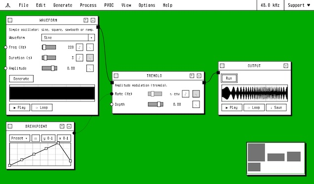

# cdp-web

A retro computing themed node graph front-end for
[`@olilarkin/cdp-wasm`](https://github.com/olilarkin/cdp-wasm) engine. Also
serves as the UI for [cdp-plugin](https://github.com/cdp-wasm-suite/cdp-plugin)
and [cdp-extension](https://github.com/cdp-wasm-suite/cdp-extension).

Based on the algorithms and documentation of the
[Composer's Desktop Project](https://www.composersdesktop.com/).

Embeds the [FAUST compiler](https://github.com/grame-cncm/faustwasm) for 
custom DSP nodes.



## Running it locally

All runtime dependencies are committed under `vendor/`, so a bare clone can
build and run the app with no install step:

```sh
npm run build        # assembles the site into dist/pages/ from vendor/
npx serve dist/pages # or any static file server
```

### Development

`npm run serve` runs the app in place with a live dev server, and `npm run
bundle` produces an embeddable build in `dist/bundle/`. Both read from
`node_modules/`, so they need `npm install` first — which requires the sibling
`file:` packages `../cdp-wasm` and `../cdp-sampler` checked out alongside this
repo.

```sh
npm install
npm run serve # http://localhost:8000/  (pass a port: node serve.mjs 3000)
```

## Vendored dependencies

- **`@olilarkin/cdp-wasm`**
- **`@olilarkin/cdp-sampler`**
- **`@grame/faustwasm`**

## License

LGPL-2.1-or-later — see [`LICENSE`](LICENSE).

Copyright [Oliver Larkin](https://www.olilarkin.com/) 2026. 
